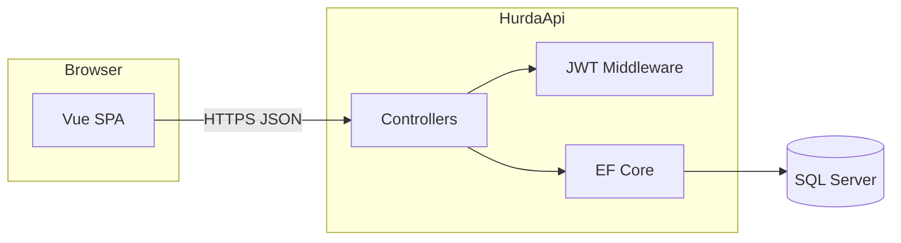
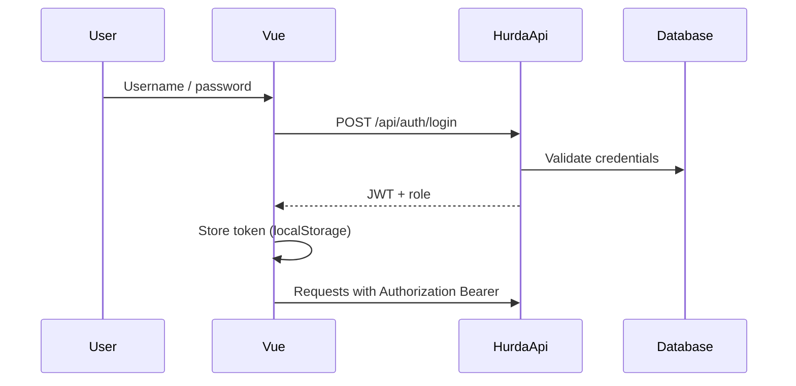

# Scrap (Hurda) Management System

A small **full-stack** application for tracking **scrap / reject quantities** in an injection-moulding or production context. Only authorised users can update counts; everyone else sees a read-only list. The backend is **ASP.NET Core Web API**, persistence is **Microsoft SQL Server**, and the frontend is **Vue 3 + Vite**. Authentication uses **JWT**; access control is **role-based**.

---

## What it does

| Role | Capabilities |
|------|----------------|
| **Admin** | Views the scrap list and can edit **scrap quantity** (`ScrapAmount`) per row. |
| **User** | Same list, **read-only**; cannot update quantities. |

Records include **audit fields** in the database: creation/update timestamps and user identity (`CreatedDate`, `CreatedBy`, `UpdatedDate`, `UpdatedBy`).

The list UI supports **search by material description**, **column sorting**, and parsing of a structured `Description` string into **material code**, **mould code**, and **cavity** columns.

---

## Tech stack

- **API:** .NET 10, ASP.NET Core, Entity Framework Core, JWT Bearer  
- **Database:** SQL Server (sample connection: `SQLEXPRESS`, database `HurdaDb`)  
- **Frontend:** Vue 3 (Options API), Vue Router, Axios  
- **Tooling:** EF Core migrations (`dotnet ef`), npm / Vite  

---

## Architecture overview



**Authentication flow (high level):**



---

## Repository layout

```
HurdaProje/
├── Controllers/          # Auth, Hurda endpoints
├── Data/                 # AppDbContext
├── Dtos/                 # Login, update payloads
├── Entities/             # User, HurdaItem, AppSetting
├── Migrations/           # EF Core schema history
├── Services/             # TokenService (JWT issuance)
├── Properties/           # launchSettings (e.g. http://localhost:5283)
├── Program.cs
├── appsettings.json
└── hurda-frontend/       # Vue app (Vite)
    └── src/
        ├── views/        # Login, HurdaList, HurdaAdd
        ├── api.js        # Axios base URL + token interceptor
        └── router.js     # Routes and auth guard
```

---

## Prerequisites

- [.NET SDK](https://dotnet.microsoft.com/download) (10.x)  
- [Node.js](https://nodejs.org/) (LTS recommended)  
- SQL Server (e.g. **SQL Server Express**)  
- Git (optional)  

---

## Database setup

1. Edit `ConnectionStrings:DefaultConnection` in `appsettings.json` for your server.  
2. From the solution root:

```bash
dotnet ef database update
```

If you need a new migration after model changes:

```bash
dotnet ef migrations add <MigrationName>
dotnet ef database update
```

Seed `Users` (and any demo data) in your own environment. The sample login flow compares passwords as **plain text** in `PasswordHash` for learning purposes — use proper **hashing + salt** (e.g. ASP.NET Identity `PasswordHasher`) before production.

---

## Run the API

```bash
cd HurdaProje
dotnet run
```

Default HTTP URL: **http://localhost:5283**  

You can exercise endpoints via Postman, the included `.http` file, or the Vue client. Swagger is not required for this repo.

### Main endpoints

| Method | Path | Auth | Description |
|--------|------|------|-------------|
| POST | `/api/auth/login` | None | Body: `{ "username", "password" }` → JWT |
| GET | `/api/hurda` | Bearer | All scrap items |
| POST | `/api/hurda/items` | **Admin** | Body: [`AddHurdaItemDto`](Dtos/AddHurdaItemDto.cs) — create item (Yeni eşya ekle) |
| PUT | `/api/hurda/{id}` | **Admin** | Body: `{ "scrapAmount" }` — update scrap count |

CORS allows `http://localhost:5173` and `http://localhost:5174` for local development.

---

## Run the frontend

```bash
cd hurda-frontend
npm install
npm run dev
```

The dev server is usually **http://localhost:5173**. Ensure `src/api.js` `baseURL` matches your API host.

---

## `HurdaItem` and `Description` format

- **Name:** Material / part description shown in the table.  
- **Description:** Optional structured text. If it matches the pattern below, the UI splits it into three columns:  
  - `Kod: <material code> | Kalıp: <mould code> | Cavity: <cavity text>`  
- **ScrapAmount:** Scrap quantity (editable by Admin).

Example:

`Kod: 0008002 | Kalıp: C000007391 | Cavity: A-B-C-D`

→ **Material code:** `0008002` · **Mould code:** `C000007391` · **Cavity:** `A-B-C-D` (label `Cavity:` is not repeated in the cavity column).

If the pattern does not match, those three cells show an em dash (`—`); **Name** and other fields still display.

---

## Security notes (before production)

- Keep the JWT **signing key** secret; prefer **User Secrets** or environment variables over committing real keys.  
- Do not store passwords in plain text.  
- Do not commit production connection strings or credentials.  
- Enforce HTTPS and appropriate token lifetimes for your deployment.

---

## License

Personal / educational use. Adjust this section if you adopt an open-source license for your portfolio.

---

*Documentation aligned with the current codebase (API + Vue client, role-based scrap quantity management).*
